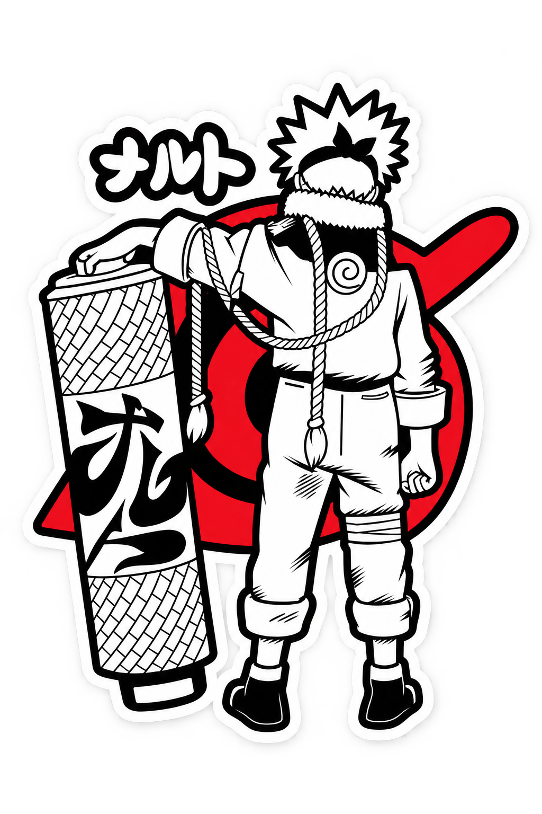

<div align="center">

# 🩸 RED-SHINOB

### `ANIME • MOTION • ART • CODE`

<br>



<br><br>


<br><br>


</div>

---

## 🩸 RED-SHINOB

> **A creative portfolio where anime aesthetics meet motion, design and storytelling.**

**Red-Shinob** is a dark, anime-inspired portfolio website created around
bold typography, cinematic visuals, neon colors and manga-style artwork.

The visual identity combines:

**Black × Purple × Neon Green × Cyan × Crimson**

---

## ⚡ CREATIVE IDENTITY

<div align="center">

`🎨 ART` &nbsp;&nbsp;
`🎬 MOTION` &nbsp;&nbsp;
`⚡ ANIMATION` &nbsp;&nbsp;
`🌀 ANIME` &nbsp;&nbsp;
`💻 CODE`

</div>

### Creator

**Ankit Sharma**

- 🎨 2D Animator
- 🎬 Motion Designer
- 🎥 Video Editor
- 💻 Creative Developer

---

## 🌀 THE CONCEPT

The website is designed to feel less like a traditional portfolio
and more like entering a small anime universe.

```text
                    RED-SHINOB
                         │
             ┌───────────┴───────────┐
             │                       │
           SHADOW                  MOTION
             │                       │
             ▼                       ▼
            INK                    ENERGY
             │                       │
             └───────────┬───────────┘
                         │
                         ▼
                       ART
                         │
                         ▼
                      STORY
